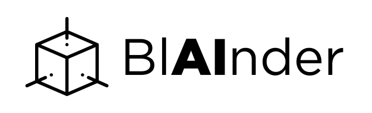

My overall goal is that we can use Blender as a data generator for various ML and robotics applications (in my head this is called **BlAInder**). 

Due to ML some specific things (labeling & data formats) have to be considered. In order to use Blender for this, different sensors are needed. For the current research in our company these are above all:

- RGB-D cameras (e.g. Kinect)
- LiDAR (surface analysis, see [https://www.blensor.org/](https://www.blensor.org/))
- Sonar (underground analysis, multibeam, singlebeam...)
- Omnidirectional cameras (see [https://github.com/uzh-rpg/rpg_blender_omni_camera](https://github.com/uzh-rpg/rpg_blender_omni_camera))

For all sensors the sensor specs have to be considered as well as the physical limitations. All data has to be labelled, i.e. you get the IDs for each process on Blender and map them to the respective output. This is a unique selling point (e.g. compared to the LiDAR package for ROS). For point clouds, an ID is assigned to each point that is created by a Ray Intersect on an object (LiDAR, sonar), for images (RGB-D, cameras) the information would have to be transferred into the rendered image (as bounding box or pixelwise labels). This can be found, for example, here: [https://arxiv.org/pdf/1709.00849.pdf](https://arxiv.org/pdf/1709.00849.pdf).

Physically it becomes interesting for certain diffuse (black, white) and (semi)transparent materials (especially glass). There are also error models for this. It is also important that the measurements in our projects are carried out in different ways. At [AIRGEMM](https://tu-freiberg.de/airgemm) we partly fly over a water body, partly measure from the robotic boat. There are certain error models and restrictions for both (see e.g. [https://www.neonscience.org/lidar-basics](https://www.neonscience.org/lidar-basics)).

The quality of the scene depends on the sensor. For point clouds and depth images, meshes made of critical materials, such as glass, are mostly sufficient. For real image analysis the rendering would have to be of higher quality, but that would not be part of the MA. If the images were added, colored primitives against white background would be sufficient or something like that. 

The programming goal is a plugin for Blender. The similar project Blensor added all the Ray methods in C++ via patch and then implemented a Python plugin for UI and programming. Something similar is in my mind. This is performant and accessible. Blensor is outdated and has only limited functionality, but it is a good basis. 
