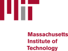



My studies led me first into the field of transport sciences, which fascinated me with its many interdependencies and complex networks. Due to the lower proportion of computer science in my studies, I have been studying computer science at the Fernuni Hagen as a second degree course since 2016. At the same time I was given the opportunity to work in computer science at the TU Bergakademie Freiberg after my doctoral thesis. 

<table class="tg">
  <tr>
    <td class="tg-0lax">since 04/2023</td>
    <td class="tg-0lax">Research Fellow at <b>Lund University</b>, <a href="https://rss.cs.lth.se/">Robotics and Semantic Systems</a> group</td>
  </tr>
    <tr>
    <td class="tg-0lax">since 01/2023</td>
    <td class="tg-0lax">Research Fellow at <b>Freiberg University of Mining & Technology</b>, <a href="https://ubisys.org">Ubiquitous Computing & Smart Systems</a> group</td>
  </tr>
   <tr>
    <td class="tg-0lax">01/2022 - 12/2022</td>
     <td class="tg-0lax">Research Group Leader in ESF project <i>RoboBoatAssist</i> at <b>Freiberg University of Mining & Technology</b>, <a href="http://vr.tu-freiberg.de/">Chair of Virtual Reality &amp; Multimedia</a></td>
  </tr>
  <tr>
    <td class="tg-0lax">10/2020</td>
    <td class="tg-0lax">Defense of the doctoral thesis (mark: magna cum laude) "Artificial Neural Networks in Performance Based Airport Management"</td>
  </tr>
  <tr>
    <td class="tg-0lax">09/2019 - 12/2021</td>
    <td class="tg-0lax">Research Fellow at <b>Freiberg University of Mining & Technology</b>, <a href="http://vr.tu-freiberg.de/">Chair of Virtual Reality &amp; Multimedia</a></td>
  </tr>
    <tr>
    <td class="tg-0lax">since 09/2015 </td>
    <td class="tg-0lax">Studies of Computer Science at Fernuniversität Hagen (distance learning, part-time)</td>
  </tr>
  <tr>
    <td class="tg-0lax">09/2015 - 08/2019 </td>
    <td class="tg-0lax">PhD Student at <b>German Aerospace Center (DLR)</b> Brunswick, <a href="https://www.dlr.de/fl/">Institute of Flight Guidance</a></td>
  </tr>
  <tr>
    <td class="tg-0lax">08/2015</td>
    <td class="tg-0lax">Diploma Thesis (mark: 1.4) "Development of a model for the creation of generic flight plans for airport clusters" </td>
  </tr>
  <tr>
    <td class="tg-0lax">2009 - 2015 </td>
    <td class="tg-0lax">Studies of Traffic Engineering at <b>TU Dresden</b></td>
  </tr>
  <tr>
    <td class="tg-0lax">2007 </td>
    <td class="tg-0lax">Abitur at Gymnasium Dresden-Cotta</td>
  </tr>
  <tr>
    <td class="tg-0lax">1988 </td>
    <td class="tg-0lax">born, son of <a href="https://www.vreitmann.de">Prof. Dr. Volker Reitmann</a></td>
  </tr>
</table>

Scholarships & Awards
======

Both in my studies and in my postgraduate career, I was given opportunities for various stays abroad, for which I am very grateful. Through the *ERASMUS* program, I visited the Loughborough University in the United Kingdom for one semester during my studies. During my doctoral studies, I was a visiting scientist at St. Petersburg State University in Russia through the *G-RISC* program. As a PostDoc, I was a visiting scientist at Massachusetts Institute of Technology (MIT) in the USA through the MISTI program.

    
    
    

&nbsp;

<table class="tg">
    <tr>
    <td class="tg-0lax">09/2022 - 10/2022</td>
      <td class="tg-0lax">Visiting Scientist at <b>Massachusetts Institute of Technology (MIT)</b>, USA</td>
  </tr>
  <tr>
    <td class="tg-0lax">08/2021</td>
    <td class="tg-0lax">Best Paper Award at <a href="http://cpsc.spbstu.ru/">2nd International Conference on Cyber-Physical Systems and Control (CPS&C) 2021</a></td>
  </tr>
  <tr>
    <td class="tg-0lax">06/2019</td>
    <td class="tg-0lax">Best Paper Award in the Weather Track at <a href="http://www.atmseminarus.org/13th-seminar/">13th USA/Europe ATM R&amp;D Seminar</a></td>
  </tr>
  <tr>
    <td class="tg-0lax">11/2018 </td>
    <td class="tg-0lax">Visiting Scientist at TsAGI (Moscow, Russia), IFAR Young Researchers Conference</td>
  </tr>
  <tr>
    <td class="tg-0lax">07/2018</td>
    <td class="tg-0lax">Best Conference Paper Award at <a href="http://www.icrat.org/icrat/8th-international-conference/">8th International conference for Research in Air Transportation (ICRAT)</a></td>
  </tr>
  <tr>
    <td class="tg-0lax">04/2017</td>
    <td class="tg-0lax"><a href="https://www.g-risc.org/G-RISC-Award/index.html">Russian-German Young Scientist Award</a></td>
  </tr>
  <tr>
    <td class="tg-0lax">10/2016 & 10/2017 </td>
    <td class="tg-0lax">Visiting Scientist at <b>St. Petersburg State University (SPbU)</b>, Faculty of Mathematics &amp; Mechanics, Russia</td>
  </tr>
  <tr>
    <td class="tg-0lax">09/2013 - 04/2014</td>
    <td class="tg-0lax">ERASMUS Exchange Student at <b>Loughborough University</b>, UK</td>
  </tr>
</table>

Misc
======

I am member of the following organizations / societies:

* Chaos Computer Club e. V. <a href="https://www.ccc.de/" target="_blank">(Website)</a>
* Gesellschaft für Informatik e. V. <a href="https://gi.de/" target="_blank">(Website)</a>

Apart from all this, I am an enthusiastic sportsman, video games developer and try myself in FL Studio or LMMS every now and then. I am part of Bonfire Interactive, an indie startup from Aachen and Dresden in Germany, which I founded with my friend Alex.

Bonfire was officially founded in 2018, but work on our game **Pale Blue Dot** already started in 2016. Pale Blue Dot is RTS game with low poly graphics, completelly basing on an open source pipeline (e. g. Blender, Godot, Gimp). To support the development we are looking for freelancing contributors or employees which will help to make Pale Blue Dot happen. 

The game is funded by the [nordmedia – Film- und Mediengesellschaft Niedersachsen/Bremen mbH](https://www.nordmedia.de). 

For more information visit the official [homepage](https://www.bonfire-Interactive.com).

<!--
Work experience
======
* Summer 2015: Research Assistant
  * Github University
  * Duties included: Tagging issues
  * Supervisor: Professor Git

* Fall 2015: Research Assistant
  * Github University
  * Duties included: Merging pull requests
  * Supervisor: Professor Hub

-->
  

  
<!-- 
Teaching
======
  <ul>
    
  </ul>
  -->
