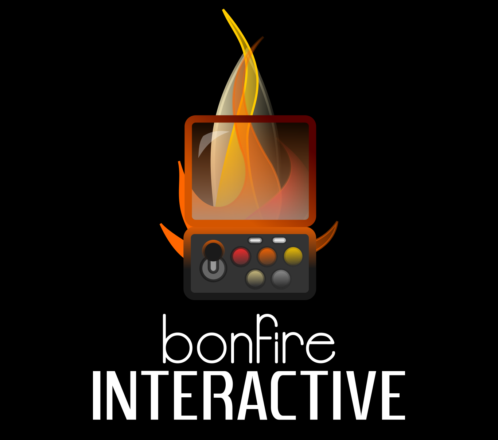

# Bonfire Interactive

In 2018 I was co-founder of an indie game dev studio in Brunswick named Bonfire Interactive. 

{:height="50%" width="50%"}

Bonfire was officially founded by Alexander Gillissen and me in 2018, but work on our game **Pale Blue Dot** already started in 2016. We are gamers from heart and have been since our youth and now we live our early dream of developing our own game. To support development we are looking for freelancing contributors or employees which will help to make Pale Blue Dot happen. 

Pale Blue Dot is RTS game with low poly graphics, completelly basing on an open source pipeline (e. g. Blender, Godot, Gimp). 

The game is funded by the [nordmedia – Film- und Mediengesellschaft Niedersachsen/Bremen mbH](https://www.nordmedia.de). 
