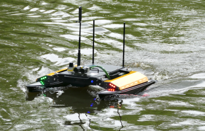
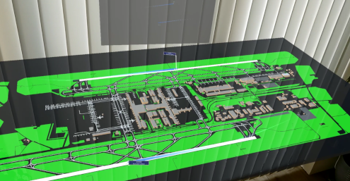
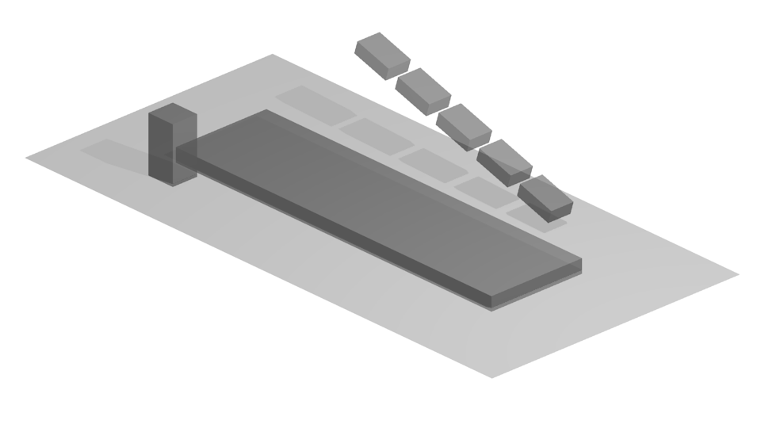
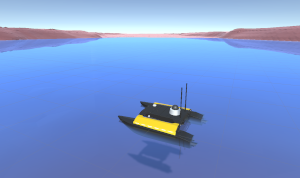
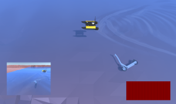
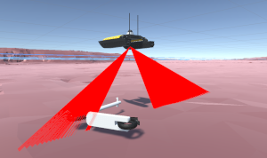

> My research focus is on the interaction of AI, robotics and VR/AR for intelligent autonomous systems. In particular, I am interested in how a robot's AI can be trained in simulated virtual worlds and on the basis of synthetic data, e.g. by simulation of virtual sensors (LiDAR, sonar) or related to the behavior of virtual agents, e.g. in game engines (Unity, Unreal). Furthermore I investigate the opportunities of VR/AR for telerobotics and assistance systems.

During my academic journey I was or have been involved in the following projects:

**AI-powered situational awareness for man-machine interaction in shared autonomy (AISA)** 
: Funded by the *Wallenberg AI, Autonomous Systems and Software Program (WASP)*
: Research fellow @ Lund University
: 2023 - 2025

**RoboBoatAssist**
: Funded by the *European Social Fund (ESF)*
: Research group leader @ Freiberg University of Mining & Technology
: 2022 - 2023

**AI and Robotics for GeoEnvironmental Modeling and Monitoring (AIRGEMM)** 
: Funded by the *European Social Fund (ESF)*
: Research fellow @ Freiberg University of Mining & Technology
: 2019 - 2021

## Human-computer interaction 

My research in the field of human-computer interaction includes the development of modern interfaces for monitoring and controlling complex systems. This includes human-robot interaction in form of a teleoperation system for mobile robots (robotic boats and delivery robots) using VR/AR technologies. These technologies are also used to provide modern traffic control systems, e.g. to support air traffic controllers.

In the project AISA I want to improve situational awareness for operators of autonomous systems (especially autonomous cars) to resolve complex situations where the system has to yield control back to the operator. This will be done with the help of AI based approaches and VR / AR interfaces

     &nbsp;
     

## Applied machine learning

Scientific and technical goals in the analysis of complex geophysical data sets concern e.g. the development of AI-based prediction methods for the detection of disturbances and boundary layers. These predictions will form the basis for significantly more efficient simulations, e.g. for solving of inverse problems in the area of electromagnetic geophysics. Further work addresses e.g. automated data processing workflows to establish model-driven machine learning pipelines using heterogenous geological data repositories.

For the creation of a high variety of ground truth data for supervised learning approaches, we developed a virtual depth-sensing addon for Blender called *BlAInder*. You can find this tool [here](https://www.mdpi.com/1424-8220/21/6/2144).

    
    
    

 In my doctoral thesis I dealt with the application of neural networks (MLP, RNN/LSTM, hybrids) in time series prediction in air traffic forecasts. Besides multidimensional modeling, I was able to extract knowledge from neural networks by using genetic algorithms. 
 
 You can find my PhD thesis [here](https://nbn-resolving.org/urn:nbn:de:bsz:14-qucosa2-729299).
 

## Robotics

In order to train virtual agents (especially mobile roboters and autonomous cars) in artificial worlds, I develop concepts to bring them into suitable environments and to transfer the AI trained there to the outside. For this purpose, game engine simulations are used and connected to ROS. Within my research I develop frameworks for these engines to create an interference engine for AI. Agents will be trained by reinforcement and supervised learning using synthetic training data.

In order to provide a sufficient virtual environment, several environmental phenomena and objects are included, e.g. fish swarms, water physics and environmental influences on sensor systems (e.g. salinity, fog).

     &nbsp;
     &nbsp;
    

<!--

Publications
======
  <ul>
    
  </ul>
  
Talks
======
  <ul>
    
  </ul>


  You can also find my articles on <u><a href="{{author.googlescholar}}">my Google Scholar profile</a>.</u>





  

-->
