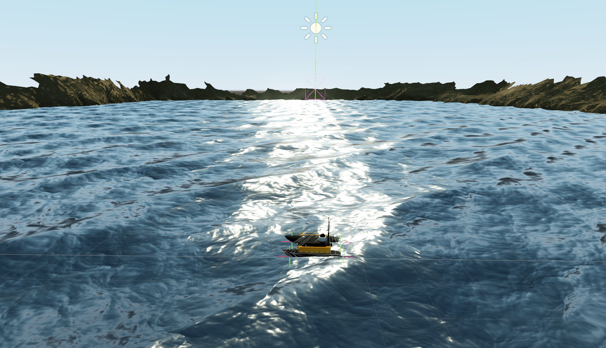
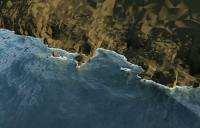

> My research focus is on the interaction of AI, robotics and VR/AR for intelligent autonomous systems. In particular, I am interested in how a robot's AI can be trained in simulated virtual worlds and on the basis of synthetic data, e.g. by simulation of virtual sensors (LiDAR, sonar) or related to the behavior of virtual agents, e.g. in game engines (Unity, Unreal). Furthermore I investigate the opportunities of VR/AR for telerobotics and assistance systems.

## Virtual sensors for synthetic data generation

In my habilitation thesis I apply machine learning methods on complex geophysical data sets. Scientific and technical goals concern e.g. the development of AI-based prediction methods for the detection of disturbances and boundary layers. These predictions will form the basis for significantly more efficient simulations, e.g. for solving of inverse problems in the area of electromagnetic geophysics. Further work addresses e.g. automated data processing workflows to establish model-driven machine learning pipelines using heterogenous geological data repositories.

You can find more information about our projects [AIRGEMM](https://tu-freiberg.de/airgemm) (*AI and Robotics for GeoEnvironmental Modeling and Monitoring*) and [RoboBoatAssist](https://tu-freiberg.de/robo-boat-assist) on the web.

    
    
    

## Simulation of mobile robots

In order to train virtual agents (especially mobile roboters) in artificial worlds, I develop concepts to bring them into suitable environments and to transfer the AI trained there to the outside. For this purpose, several game engines (e. g. Unity) are used and connected to ROS. Within my research I develop frameworks for these engines to create an interference engine for AI. Agents will be trained by reinforcement and supervised learning using synthetic training data.

    
    

## Machine learning in time series prediction

 In my doctoral thesis I dealt with the application of neural networks (MLP, RNN/LSTM, hybrids) in time series prediction in air traffic. Besides multidimensional modeling, I have been able to extract knowledge from neural networks by using genetic algorithms. 
 
 You can find my PhD thesis [here](https://nbn-resolving.org/urn:nbn:de:bsz:14-qucosa2-729299).
 

## Telerobotics with VR/AR 

For a better understanding of the measurements of our robotic boat and their visualization, we are in the development of an AR application. Thereby, measured point clouds are to be displayed correctly from the edge of the bank at the target water body and registered into the environment. On the one hand, this involves a live view of a measurement run, and on the other hand, the display of an already measured set of points in their entirety. 

A Microsoft HoloLens 2 (HL2) is used as AR hardware, whereby this is to be used as a stand-alone solution, i.e. without an external computing unit. This concept allows mobile applications at the waters, but limits the display scope of the point clouds (according to empirical values, a maximum of 300,000 points). The application is implemented as a Unity application and uses the pcx-Point Cloud Importer [https://github.com/keijiro/Pcx](https://github.com/keijiro/Pcx) to display the point clouds. 

<!--

Publications
======
  <ul>
    
  </ul>
  
Talks
======
  <ul>
    
  </ul>


  You can also find my articles on <u><a href="{{author.googlescholar}}">my Google Scholar profile</a>.</u>





  

-->
