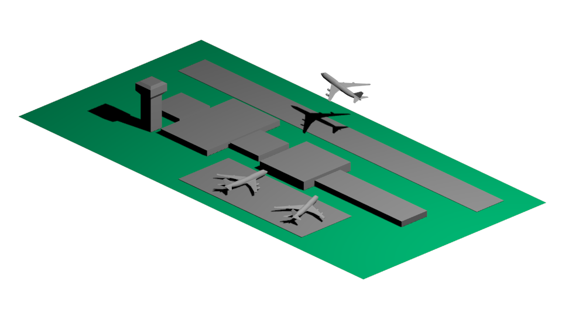
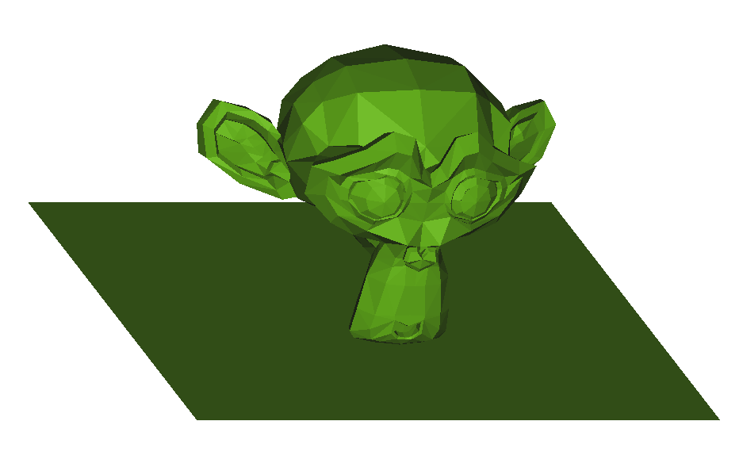
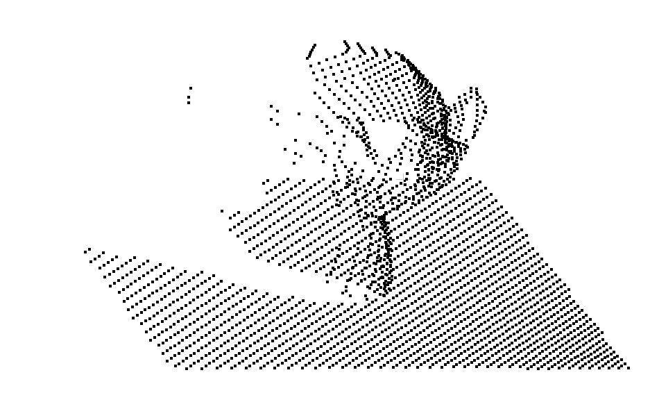
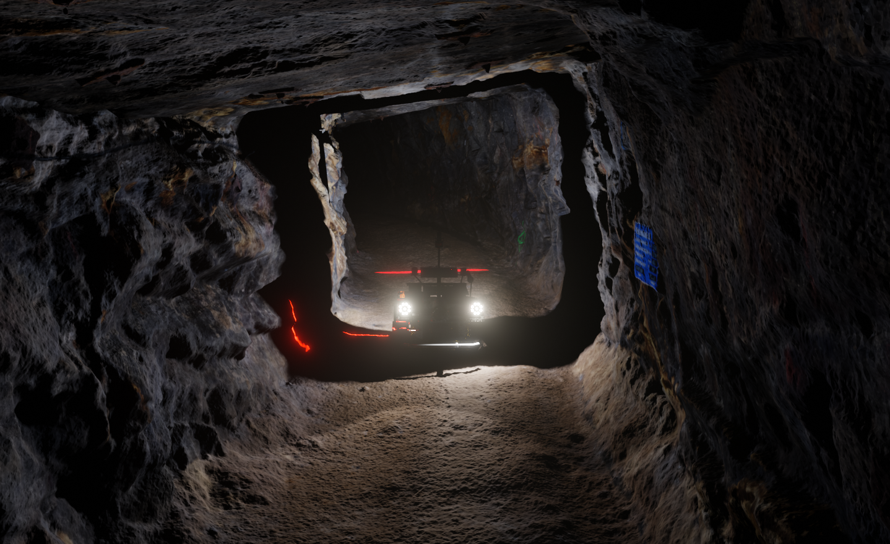

> Currently, my research focus is on synthetic data and virtual sensors for lab-based preparation of ML applications for reality. For modeling and data generation I use Blender and own plugins, which I combine with ML algorithms like GANs and AE. I mainly code in Python and C++. For ML applications I use TensorFlow, sklearn, pytorch and YOLO. I regularly work with the game engines UE4 and Godot and use the software Blender to design and simulate virtual worlds.

## Machine learning in time series prediction

 In my doctoral thesis I dealt with the application of neural networks (MLP, RNN/LSTM, hybrids) in time series prediction in air traffic. Besides multidimensional modeling, I have been able to extract knowledge from neural networks by using genetic algorithms. 
 
 You can find my PhD thesis [here](https://nbn-resolving.org/urn:nbn:de:bsz:14-qucosa2-729299).
 

## Machine learning in computer vision 

In my habilitation thesis I apply machine learning methods on complex geophysical data sets. Scientific and technical goals concern e.g. the development of AI-based prediction methods for the detection of disturbances and boundary layers. These predictions will form the basis for significantly more efficient simulations, e.g. for solving of inverse problems in the area of electromagnetic geophysics. Further work addresses e.g. automated data processing workflows to establish model-driven machine learning pipelines using heterogenous geological data repositories.

You can find more information about our project AIRGEMM (*AI and Robotics for GeoEnvironmental Modeling and Monitoring*) [https://tu-freiberg.de/airgemm](here).

<figure>
    
    <figcaption>3D mesh</figcaption>
</figure>
<figure>
    
    <figcaption>Point cloud</figcaption>
</figure>
<figure>
    
    <figcaption>Labeled point cloud</figcaption>
</figure>

## AI in virtual worlds 

## VR/AR

I published in several traffic and informatics related journals and participated in international conferences. In addition to my scientific work I am student of Informatics at the University Hagen and game developer in a small game dev studio in Dresden.

<!--

Publications
======
  <ul>
    
  </ul>
  
Talks
======
  <ul>
    
  </ul>


  You can also find my articles on <u><a href="{{author.googlescholar}}">my Google Scholar profile</a>.</u>





  

-->
